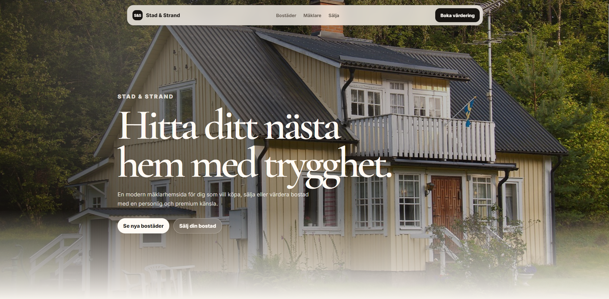
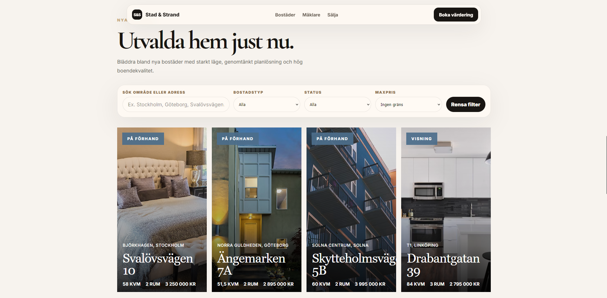

# Stad & Strand Mäklarhemsida — Concept


En premium mäklarhemsida skapad som ett portfolio-projekt.

Projektet är byggt med React, TypeScript, Vite och komponenter från ReactBits, med fokus på modern layout, responsiv design, interaktiva komponenter och en exklusiv visuell känsla.


## Egenskaper


* Minimal floating navigation

* Hero section med stor bakgrundsbild

* Svenska texter anpassade för en mäklarhemsida

* Filtrerbara bostadslistningar

* Sökfunktion för bostäder

* Property cards med premium bild-layout

* Property detail modal

* Mäklare-cards med reflective hover-effekt

* Subtil BorderGlow på utvalda cards

* Sälj bostad-formulär med success feedback

* Responsiv design för desktop och mobil


## Tech Stack


* React

* TypeScript

* Vite

* CSS

* ReactBits-inspired components

* Font Awesome


## Bilder


Lägg till screenshots här när du har tagit bilder på sidan.


```md







```


## Installera Projectet


```bash

npm install

npm run dev

```


## Build


```bash

npm run build

```


## Viktigt


Detta är ett fiktivt design- och frontend-projekt skapat för lärande och portfolio. Stad & Strand är inte ett riktigt mäklarföretag.

## Live Demo

[View live site](https://realestate-website-for-portfolio.vercel.app/)

